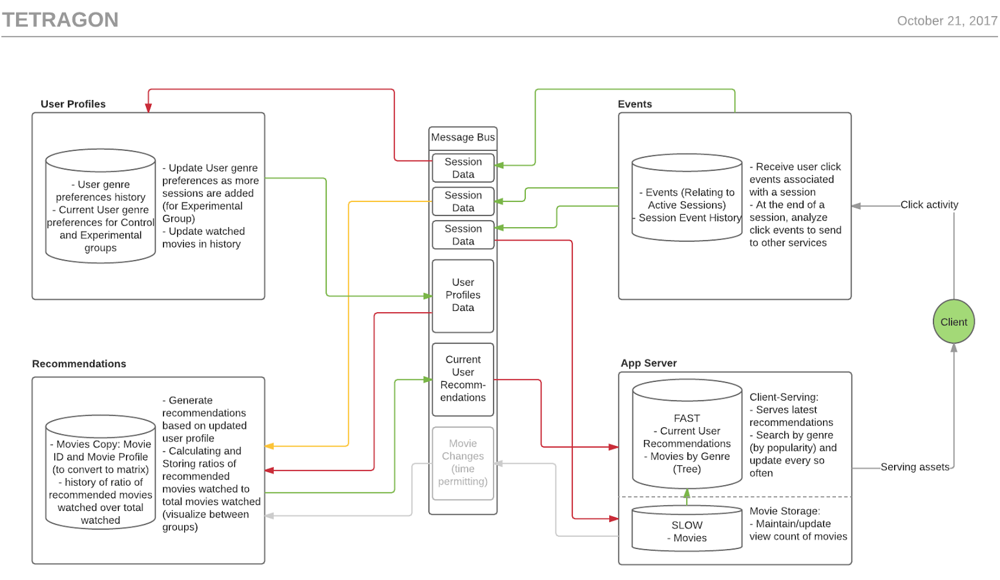
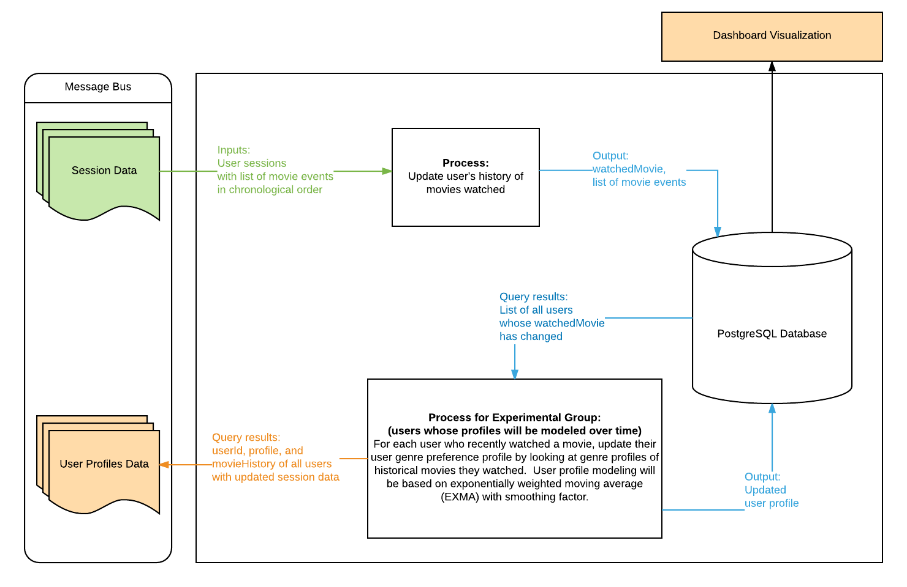
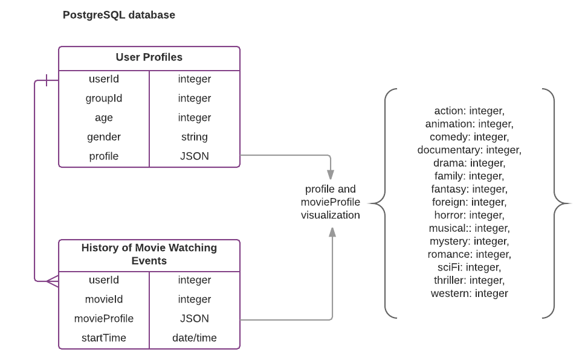

# Tetraflix: User Profiles Service

The User Profiles Service manages user genre preference profiles and movie watch history for all Tetraflix users. The service constantly interprets session data to model and update user genre preferences profile, which is a collection of genres and numbers (0-100) representing user's preference to the respective genre. For the users in the Control group, their genre preference profiles are fixed to the initial stated genre preferences. For the users in the Experimental group, their genre preference profiles are updated based on exponentially weighted moving average (EWMA) of movies user has watched over time to take into consideration content drift of user preference.

## Roadmap

View the project roadmap [here](LINK_TO_DOC)

## Contributing

See [CONTRIBUTING.md](CONTRIBUTING.md) for contribution guidelines.

# Table of Contents

1. [Development](#development)
    1. [Installing Dependencies](#installing-dependencies)
1. [Data Flow](#data-flow)
1. [Requirements](#requirements)
1. [Service Architecture](#service-architecture)
1. [Inputs/Outputs](#inputs-and-outputs)

## Development

From within the root directory, run the following npm scripts to start server development:

```
npm start
```
To create the tables and seed the tables with initial data, install Postgres and run the setup script on the command line from the root directory:

```
node database/setup.js
``` 

### Installing Dependencies

From within the root directory:

```
npm install
```

## Data Flow



#### User Profiles
- Subscribed to one of the three Session Data channels (more detail on expected inputs in User Profiles Documentation).
- Updates the user’s history of movies watched in the database.
- If the user associated with the Session is in the Experimental group, updates user’s genre preference profile using the list of historical movies user has watched.  User profile modeling will be based on exponentially weighted moving average (EWMA) of movie profiles to give more weight to recently watched movies in order to take into consideration content drift of user preference.
- Sends the user’s current profile data (regardless of testing group) to the User Profile Data channel on the message bus.

## Requirements

- Node/Express
- Postgres

## Service Architecture



## Inputs and Outputs



#### Input

- Session data containing summary of user’s movie watching events during a session
- Each entry in session data contains user id, group id, and events array that contains event summary in chronological order.  Event summary contains movie object with movie id and movie profile, percentage of movie watched, and timestamp.

```javascript
{
  userId: 534356757834,
  groupId: 1,
  events: [
    {
      movie: {
        id: 543,
        profile: {action: 40, comedy: 60}
      },
      progress: 1,
      startTime: 2017-09-08 12:50:00
    }, {
      movie: {
        id: 155,
        profile: {drama: 100, comedy: 0}
      },
      progress: 0.7,
      startTime: 2017-09-08 2:50:00
    }
  ]
}
```

#### Output

- User Profiles data with updated user genre preference profile and movie watch history
- Each entry in user profiles data contains user id, user genre preference profile, and movie history array in chronological order (including movies in progress).  User genre preference profile is an object with various genres as properties and preference ratings (range from 0 to 100) as values.

```javascript
{
  userId: 534356757834,
  profile: {action: 33, comedy: 20, drama: 44, romance: 33,
    SF: 2, ...},
  movieHistory: [543, 155, ...],
}
```